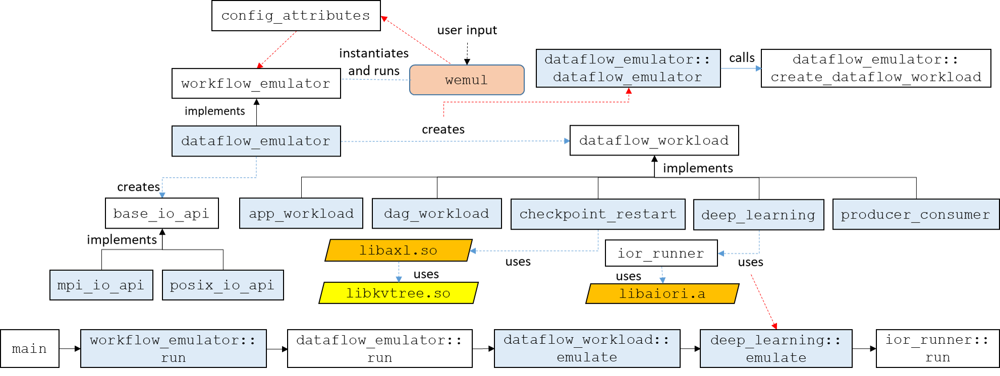
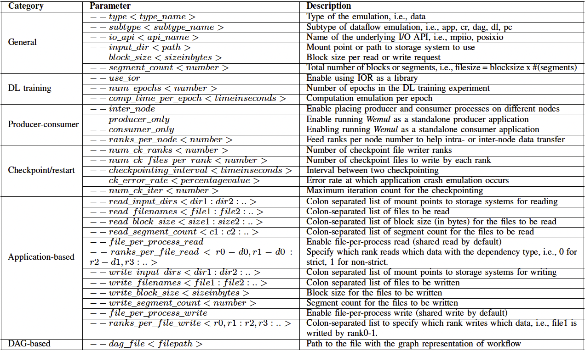

# Workflow I/O Emulation Framework
## Overview
Scientific application workflows leverage the capabilities of cutting-edge
high-performance computing (HPC) facilities to enable complex applications for
academia, research, and industry communities. Data transfer and I/O dependency
among different modules of modern HPC workflows can increase the complexity
and hamper the overall performance of workflows.
Understanding this complexity due to data-dependency and dataflow
is a very important prerequisite for developing optimization strategies to
improve I/O performance and, eventually, the entire workflow.
As existing I/O benchmarking tools are lacking in identifying
and representing the dataflow in modern HPC workflows,
we have implemented a workflow I/O emulation framework to mimic different types
of I/O behavior demonstrated by common and complex HPC application workflows
for deeper analysis.

## Software Architecture

    

    <em>Fig. 1: Class diagram of workflow I/O emulation framework</em>

The workflow I/O emulation framework is an MPI-enabled C++ application.
It has five modes, i.e., DL training, producer-consumer I/O, checkpoint/restart,
app-based, and dag-based I/O workloads.
As shown in Fig. 1, *emulator* is the entry point
that exposes the functionalities of the framework to the users.
The parameter values are recorded in the *config_attributes* module.
The *dataflow_emulator*, derived from generic *workflow_emulator*,
is the factory for creating different types of I/O workloads
according to the user-defined configuration.
Besides, *app_workload*, *dag_workload*, *deep_learning*, etc., implement
the base *dataflow_workload* class.
Interleaved-Or-Random (IOR), is used as a static library
to provide flexibility in finer granularity. For now, it can be optionally
utilized from *deep_learning* module through *ior_runner* class,
but is extensible to be used more robustly in the future.
Asynchronous Transfer Library (AXL) is also imported
as a library from *checkpoint_restart* module for staging the data files
in and out according to user parameters.

## Functionality and Usage

    

    <em>Table 1: User parameters of workflow I/O emulation framework</em>

The I/O emulation framework takes the information about a workload execution
from the user via command-line parameters.
The parameters are categorized into six basic classes. Firstly, the "General" category has the
parameters related to starting information for the framework, i.e., *type* of emulation
(we keep this parameter for future extension), *subtype* to specify an execution mode,
and *I/O API*, e.g., mpiio, posixio, etc.
Besides, there are some generic I/O pattern related parameters like *block size* and
*segment count* of the I/O requests in a workload.
The rest of the categories are execution mode-specific. For instance, "Application-based"
category has parameters to set the file list for reading and writing by the emulation framework
and access patterns. "DAG-based" category has only one parameter that takes the path to the file
with DAG specification of the entire workflow.
Some mentionable parameters for "DL training", "Producer-consumer", and "Checkpoint/restart"
are the number of epochs, inter-node enabler, and the number of checkpointing ranks, respectively.
The parameters and their usage are shown in more detail in Table 1.